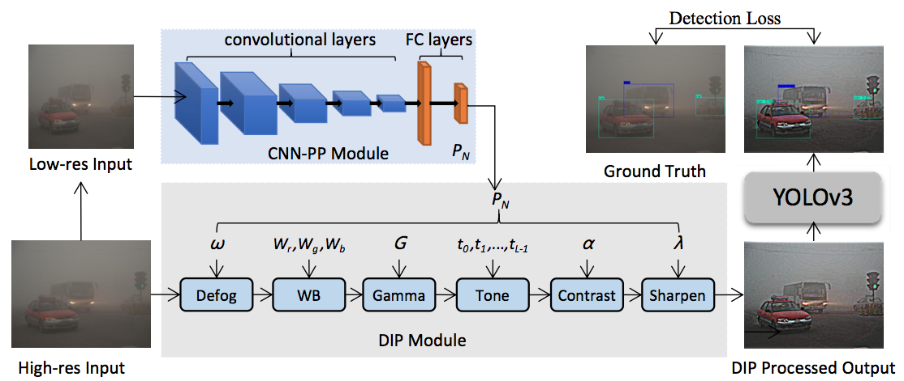

 

Footage with object detection from different weather conditions in Madison, WI (this might take some time to render).

## Motivation
Object tracking is fundamental for autonomous vehicles (AVs) to perform path planning and object avoidance. Datasets commonly used to train object tracking algorithms for AVs contain mostly video from clear, open-air environments, causing the models to fail in adverse weather conditions. Even with data available, the performance of these algorithms severely degrades in adverse weather. The inability to perform object detection and tracking in various weather conditions is therefore a major roadblock for the use of AVs. In this project, we investigate object tracking in adverse weather conditions. 

We investigate a prominent model in the object detection literature: [Image-Adaptive YOLO](https://arxiv.org/abs/2112.08088) [1], a modification of the original [YOLO](https://pjreddie.com/media/files/papers/YOLOv3.pdf) [2], "You Only Look Once", architecture with modules to perform defogging and brightening of images. Our implementation is trained on the [BDD100k dataset](https://www.bdd100k.com/) [3] and the [CADC dataset](http://cadcd.uwaterloo.ca) [4]. 

## Approach
We implement the IA-YOLO algorithm described in [1]. The figure below illustrates the model: 

Supporting the original YOLO model described in [2] are two modules that perform defogging and lightening on input images. The Differential Image Processor (DIP) applies standard filters like white balance, tone, and contrast to defog or lighten an image. These processed images are input for the YOLO network itself, which then outputs object detections on the images. YOLO detections are compared with ground-truth detections to produce a detection loss parameter. This detection loss "supervises" a small CNN which serves as a Parameter Predictor for the DIP. This CNN-PP learns better input parameters for the DIP filters so that YOLO outputs inform how defogging and lightening of images should be performed.

## Implementation

## Results

## Discussion

## Source Code
Code can be found at our [Github Repo](https://github.com/jonvanveen/Adverse-Weather-Object-Tracking).

## References

[1] W. Liu, G. Ren, R. Yu, S. Guo, J. Zhu, and L. Zhang, “Image-adaptive YOLO for object detection in adverse weather conditions,” arXiv preprint arXiv:2112.08088, 2021

[2] J. Redmon and A. Farhadi, "YOLOv3: An Incremental Improvement," arXiv preprint arXiv:1804.02767, 2018

[3] F. Yu, H. Chen, X. Wang, W. Xian, Y. Chen, F. Liu, V. Madhavan, and T. Darrell, "BDD100K: A Diverse Driving Dataset for Heterogeneous Multitask Learning," arXiv preprint arXiv:1805.04687, 2020

[4] M. Pitropov, D. Garcia, J. Rebello, M. Smart, C. Wang, K. Czarnecki, and S. Waslander, "Canadian Adverse Driving Conditions Dataset," arXiv preprint arXiv:2001.10117, 2020

