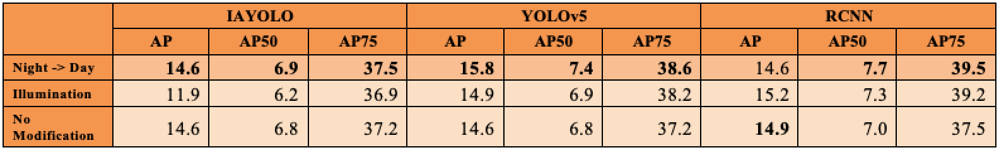

 

Footage with object detection from different weather conditions in Madison, WI (this might take some time to render).

## Motivation
Object tracking is fundamental for autonomous vehicles (AVs) to perform path planning and object avoidance. Datasets commonly used to train object tracking algorithms for AVs contain mostly video from clear, open-air environments, causing the models to fail in adverse weather conditions. Even with data available, the performance of these algorithms severely degrades in adverse weather. The inability to perform object detection and tracking in various weather conditions is therefore a major roadblock for the use of AVs. In this project, we investigate object tracking in adverse weather conditions. 

We investigate a prominent model in the object detection literature: [Image-Adaptive YOLO](https://arxiv.org/abs/2112.08088) [1], a modification of the original [YOLO](https://pjreddie.com/media/files/papers/YOLOv3.pdf) [2], "You Only Look Once", architecture with modules to perform defogging and brightening of images. Our implementation is trained on the [BDD100k dataset](https://www.bdd100k.com/) [3] and the [nuScenes dataset](https://www.nuscenes.org/nuimages) [4]. 

## Approach
We implement the IA-YOLO algorithm described in [1]. The figure below illustrates the model: 

Supporting the original YOLO model described in [2] are two modules that perform defogging and lightening on input images. The Differential Image Processor (DIP) applies standard filters like white balance, tone, and contrast to defog or lighten an image. These processed images are input for the YOLO network itself, which then outputs object detections on the images. YOLO detections are compared with ground-truth detections to produce a detection loss parameter. This detection loss "supervises" a small CNN which serves as a Parameter Predictor for the DIP. This CNN-PP learns better input parameters for the DIP filters so that YOLO outputs inform how defogging and lightening of images should be performed.

## Implementation

In addition to the IA-YOLO architecture itself, we apply a few preprocessing operations to input images to see how these affected the results. Four standard operations we employed were adding Gaussian noise, varying illumination, varying contrast, and downsampling. 

Beyond these simple modifications, we also employ image domain adaptation using Contrastive Unpaired Translation (CUT). Domain adaptations include generating from night to day and from dusk to day.

We consider two object classes in our model: vehicles and pedestrians. 

## Results

Intersection Over Union (IOU) is a key evaluation metric for bounding-box object detection. It is described visually in the figure below.

Mean Average Precision (mAP) is another common evaluation metric for object detection models. Average Precision is the area under the Precision-Recall curve, and AP50/AP75 is the area under the curve when the IoU threshold is 0.5/0.75. Precision is the percent of predictions that are correct, and recall is the percent of the target that is correctly found. The tables below show that training with synthetically generated CUT images improve the mAP of each model compared to no data modification.

<b>Table: Vehicle Results</b>

<b>Table: Pedestrian Results</b>

Sample results on test data can be seen in the dashcam video footage at the top of this page, taken driving in two different conditions around Madison, WI. One can observe that the model consistently detects objects of the category it was trained on, namely vehicles and pedestrians. It does not, however, detect much larger or smaller vehicles, such as buses or motorcycles.

## Discussion

Future work in this area would include expanding the number of classes of detected objects. We could consider bicycles, street signs, animals, and other common entities encountered while driving. For example, one might apply image super-resolution techniques to enhance and decipher words on common street signs. We expect that constructing an accurate model for several classes of objects will be more difficult than our implementation in adverse conditions.

Another direction of future work would involve increasing computational efficiency. For object tracking to be deployed in applications such as autonomous vehicles, the system must be able to produce accurate results in real time. While we showed the CUT image enhancement results in more accurate detection, it is nowhere near a real-time implementation.

## Source Code
Code can be found at our [Github Repo](https://github.com/jonvanveen/Adverse-Weather-Object-Tracking).

## References

[1] W. Liu, G. Ren, R. Yu, S. Guo, J. Zhu, and L. Zhang, “Image-adaptive YOLO for object detection in adverse weather conditions,” arXiv preprint arXiv:2112.08088, 2021

[2] J. Redmon and A. Farhadi, "YOLOv3: An Incremental Improvement," arXiv preprint arXiv:1804.02767, 2018

[3] F. Yu, H. Chen, X. Wang, W. Xian, Y. Chen, F. Liu, V. Madhavan, and T. Darrell, "BDD100K: A Diverse Driving Dataset for Heterogeneous Multitask Learning," arXiv preprint arXiv:1805.04687, 2020

[4] H. Caesar, V. Bankiti, A.H. Lang, S. Vora, V.E. Liong, Q. Xu, A. Krishnan, Y. Pan, G. Baldan, and O. Beijbom, "nuScenes: A multimodal dataset for autonomous driving," arXiv preprint arXiv:1903.11027, 2020

